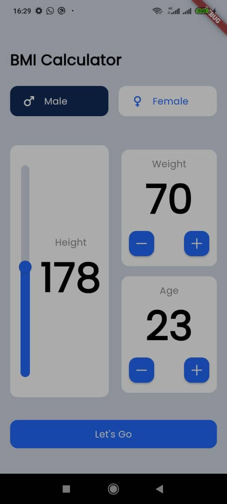
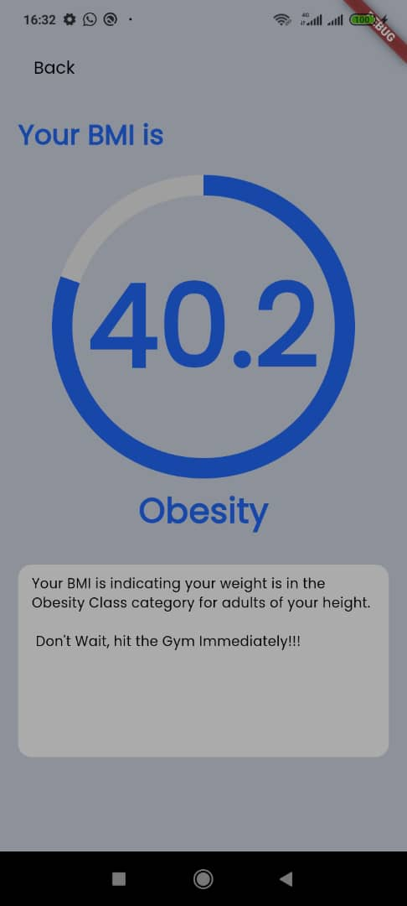

# class_app

She Code Africa Flutter Bootcamp class Playground/Exercise app.
This app demonstrates hands-on all the things learnt in the bootcamp

## First Mini-Project: BMI Calculator.
    - This feature is the first mini-project for the bootcamp class.
    - It comprises of two screens; the calculator screen and the result screen.
    - in Summary, The BMI calculator takes the user's height using the slider widget and multiplies it with
      the user's weight in the calculator screen.
    - The result of the BMI is passed to the Result screen via Route navigation.
    _ The Result screen also displays explanations for each result category
## Screenshots
    
    
## Image Link

## Getting Started

This project is a starting point for a Flutter application.

A few resources to get you started if this is your first Flutter project:

- [Lab: Write your first Flutter app](https://docs.flutter.dev/get-started/codelab)
- [Cookbook: Useful Flutter samples](https://docs.flutter.dev/cookbook)

For help getting started with Flutter development, view the
[online documentation](https://docs.flutter.dev/), which offers tutorials,
samples, guidance on mobile development, and a full API reference.
